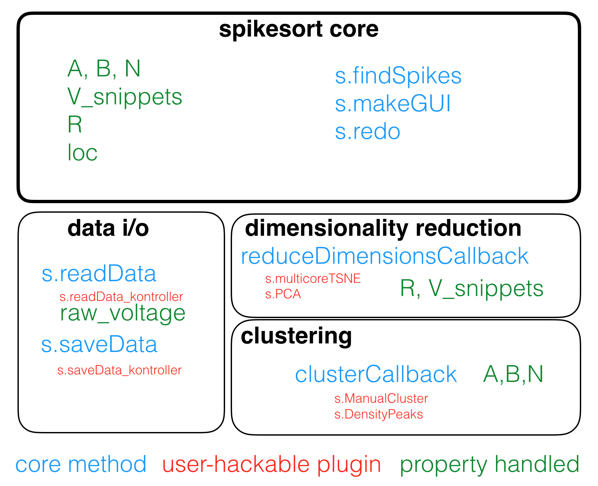

# spikesort

> Looking for the old `spikesort`? Go [here](https://github.com/sg-s/spikesort/tree/bf519e8e0caaf886ea14cc87c3b94d424574241d)

`spikesort` is a framework written in MATLAB to help you sort spikes from single-channel extracellular recordings. It is 

1. *highly modular* Almost everything is written as a plugin. `spikesort` is a [MATLAB class](https://www.mathworks.com/help/matlab/matlab_oop/classes-in-the-matlab-language.html), and plugins are methods defined within the class. 
2. *Accurate* Using the t-SNE dimensionality reduction algorithm, `spikesort` achieves a 99.5% accuracy on test data. For a full report, see [this](https://github.com/sg-s/spikesort/blob/master/tests/html/makeTestReport.pdf). 
3. *Data-agnostic* `spikesort` interfaces to your data through plugins, and `spikesort` doesn't care what your data format is.
4. *Bring-your-own-algorithm* `spikesort` splits up the spike sorting problem into two steps: dimensionality reduction and clustering. Every algorithm in either step is written as a plugin, and you can write your and drop it in, with **zero** modifications to the core code. For example, `spikesort` can use the amazing [mutli-core t-SNE algorithm](https://github.com/DmitryUlyanov/Multicore-TSNE) to embed spike shapes in two dimensions **very** rapdily. 

## Installation

`spikesort` is written in MATLAB. It should work on any OS that modern MATLAB runs on, but has only been tested on macOS Sierra. 

The best way to install `spikesort` is through my package manager: 

```
% copy and paste this code in your MATLAB prompt
urlwrite('http://srinivas.gs/install.m','install.m'); 
install sg-s/spikesort
install sg-s/srinivas.gs_mtools   % spikesort needs this package to run
install sg-s/bhtsne               % Barnes-Hut t-SNE
```

This script grabs the code and fixes your path. 

Or, if you have `git` installed:

````
git clone git@github.com:sg-s/spikesort.git
````

Don't forget to download, install and configure the other packages too (see below). 

### install [bhtsne](https://github.com/lvdmaaten/bhtsne) 

If you used `install.m` to install spikesort, you already have these toolbox. However, you need to compile to run. On *nix-like systems, navigate to the folder it is in (should be `~/code/bhtsne/`) and run the following:

```
g++ sptree.cpp tsne.cpp -o bh_tsne -O2
```

Note that my fork of `bhtsne` may have modifications, and this is what you should use with `spikesort`. If you're running Windows, you need to use whatever compiler you have to compile this. See [this](https://github.com/sg-s/bhtsne) for instructions on how to build the binary.

### install `tag`

On macOS, `spikesort` supports file tagging. To get this working, you need to have [homebrew](http://brew.sh) installed. You can then install `tag` using

````
brew install tag
````

### install [Multicore-TSNE](https://github.com/DmitryUlyanov/Multicore-TSNE)

This implementation of t-SNE is the the fastest I know of, and gets faster the more cores you throw at it. Follow the installation instructions [here](https://github.com/DmitryUlyanov/Multicore-TSNE#install). macOS users, [see this](https://github.com/DmitryUlyanov/Multicore-TSNE/issues/1#issuecomment-262938483) for installation troubleshooting. 

You then need to tell MATLAB where `Multicore-TSNE` is installed. To do this, 

1. first determine where it is installed (`pip show MulticoreTSNE`)
2. Copy and paste this code to your MATLAB `startup.m` (use `edit startup.m`)

```matlab
a_path = '/path/to/MulticoreTSNE';
path1 = getenv('PATH');
if isempty(strfind(path1,[pathsep a_path]))
    path1 = [a_path pathsep path1];
end
setenv('PATH', path1);
```

## Limitations and Scope

* sorting into only two neurons/units (A and B) is supported. spikesort will *not* support more than 2 units in the anticipated future. 
* Only 1 recording electrode is supported at a time. No support for multi-electrode arrays, nor will `spikesort` ever have support for MEAs. 


## Architecture



`spikesort` is built around a plugin architecture for the three most important things it does: 

* Data handling
* Dimensionality reduction of spike shapes
* Clustering 

### Writing your own plugins

Writing your own plugins is really easy: plugins are methods that you can simply drop into the `spikesort` classdef folder (`@spikesort`), and `spikesort` automatically figures out which methods are plugins (see naming convention below)

#### Naming and Plugin declaration
Plugins can be named whatever you want, though you are encouraged to use `camelCase` for all methods. The first three lines of every plugin should conform to the following convention:

```matlab
% spikesort plugin
% plugin_type = 'dim-red';
% plugin_dimension = 2; 
% 

```

The first line identifies the method as a `spikesort` plugin, and the second line determines the type of plugin it is. Currently, plugins can be of six types:

1. `dim-red`
2. `cluster`
3. `read-data`
4. `save-data`
5. `load-file`
6. `plot`

If you are writing a `read-data`, `save-data`,`load-file` or `plot` plugin, the convention for the first three lines is as follows:

 ```matlab
% spikesort plugin
% plugin_type = 'load-file';
% data_extension = 'kontroller'
% 
```
`data_extension` identifies the extension that `spikesort` binds that plugin to. 

`load-file` plugins are expected to populate the following fields in the `spikesort` object:

```
output_channel_names
sampling_rate
this_trial
this_paradigm
handles.paradigm_chooser.String
```
`plot-spikes` plugins are expected to read all spikes in that data file, and make a raster or a firing rate plot, with appropriate labels for each trial and paradigm set. 

# License 

[GPL v3](http://gplv3.fsf.org/)

If you plan to use `spikesort` for a publication, please [write to me](http://srinivas.gs/#contact) for appropriate citation. 

